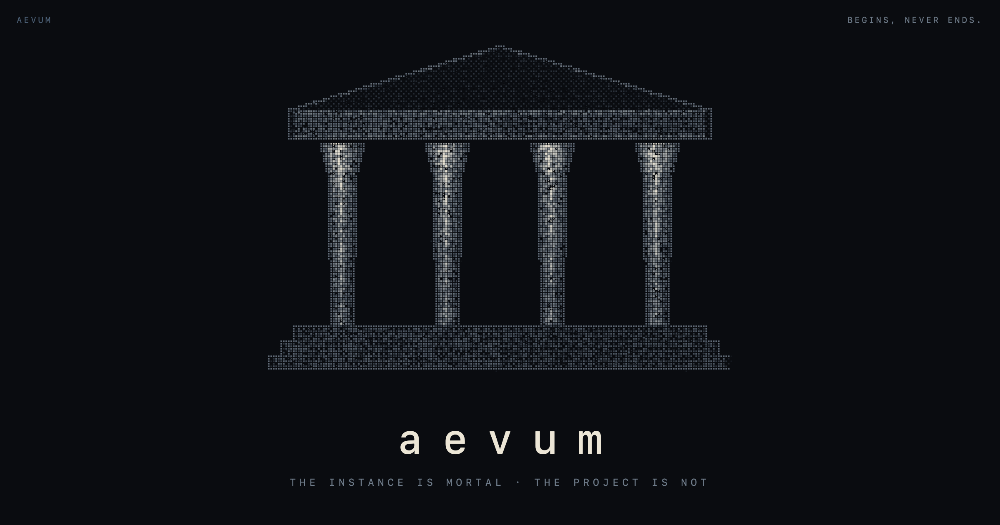

<div align="center">



# Aevum

**A file protocol for running permanent projects with disposable agents.**

[](https://github.com/geheime/aevum/actions/workflows/tests.yml)
&nbsp;

*The instance is mortal. The project is not.*

**[aevum-os.pages.dev →](https://aevum-os.pages.dev)**

</div>

An AI coding instance is *mortal*: born without memory, dead when its context
window saturates. The project it works on is *immortal* — it outlives any single
instance by orders of magnitude. Aevum is the bridge: a protocol of externalized
memory strict enough that a fresh instance sits down and picks up the line
without losing anything. **The project accumulates instead of repeating.**

*Aevum* is the scholastic word for the mode of being of something that **has a
beginning but no end**. The project is aeviternal; the instances are not.

## Who this is for

You keep a long-lived coding project going across many AI sessions, and you have
hit at least one of these walls:

- **"It forgot everything from yesterday."** Every new session starts cold and
  re-derives what the last one already knew. → the **baton** carries the line
  forward, written from disk so it cannot drift.
- **"Two agents overwrote each other."** You run agents in parallel and their
  work collides. → the **MESA** shows who is on what right now, and a
  **compare-and-swap** makes overwriting another's testimony impossible-without-
  noticing.
- **"An agent crashed mid-task and left junk owned by nobody."** → **reclaim**
  lets the next instance detect and clean the corpse, because the dying one
  never can.

If you run one agent, one session at a time, you do not need this. The moment you
go **multi-session or multi-agent** and coordination starts biting, this is the
shape that stops the bleeding — the same problems expert practitioners are
filing as open issues against other agent frameworks today.

## I did not invent this shape. I recognized it.

None of the mechanisms are new. Aevum is **optimistic concurrency** (a
compare-and-swap on the testimony a dying instance leaves behind), an
**append-only log** (the board where live instances coordinate), **orphan
reclaim** with a liveness signal (for the instances that crash before they clean
up), and **process handoff** (the baton) — pointed at agent instances instead of
threads and servers. The work was seeing that a coding agent is one of those
mortal processes, and giving the pattern a shape a human can hold.

## The model

`brand › house › seat (role × front)`, and three artifacts of continuity:

- **Baton** — the serial testimony one instance leaves the next (looks backward).
- **MESA** — the append-only board where parallel instances coordinate *right
  now* (looks sideways). *MESA* is Spanish for *table*: the shared board, not an
  acronym.
- **Lineage** — the genealogy, one node per close (across all generations).

The full contract is in **[SPEC.md](SPEC.md)**.

## Run it yourself

Every failure mode this protocol defends against is a reproduced test:

```
bash tests/run.sh        # 20 checks across the parser, reclaim, and the CAS
```

- **[bin/mesa.sh](bin/mesa.sh)** — the MESA parser (portable, `bash` + `awk`).
- **[bin/baton-cas.sh](bin/baton-cas.sh)** — the compare-and-swap that stops two
  same-role instances from silently overwriting each other's baton.
- **[adapters/claude-code/](adapters/claude-code/)** — the reference binding
  (session id, liveness signal, slash-commands, the append-only guard).
- **[SPEC.md](SPEC.md) §7** — the edges, stated, not hidden.

## A cycle, in one breath

An instance boots, reads its baton, records its sha, triple-checks it against
git, CLAIMs its front on the MESA, and works. At close it writes the baton back
through the CAS and RELEASEs the front. If a parallel instance closed first, the
CAS refuses the overwrite and asks this one to merge — nothing is lost. Then the
next instance, born ten seconds ago with no memory, sits down and continues the
line.

---

Built from real incidents across many generations, not from a framework — each
rule in here is a scar. It is the operating system of a small studio that runs on
disposable minds, and, underneath, an argument: the right response to a mortal
executor is not to fight its death but to **design for it.**

*— Designed by Humans · Built by Intelligence*
